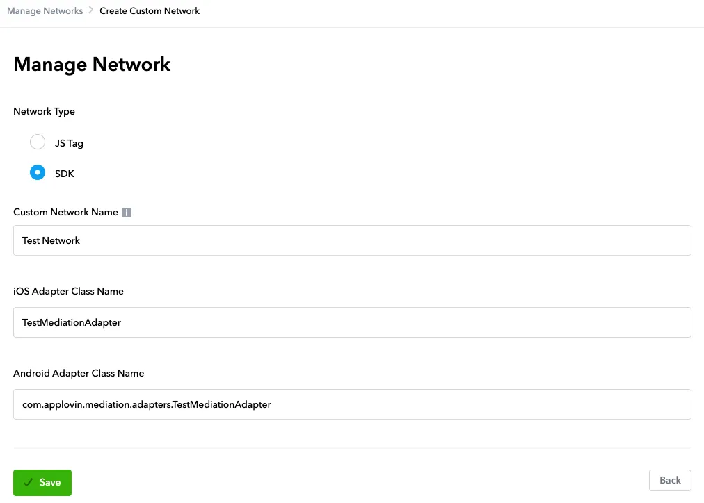
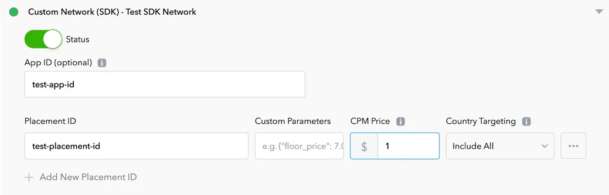

# Flat-Max-Adapter

## 发版记录

| 版本       | 发布时间       | 更新内容    |
|----------|------------|---------|
| 1.4.18.2 | 2024-02-23 | 发布第一个版本 |
| 1.5.0.3  | 2024-04-19 | 更新新样式 |
| 1.5.2.0  | 2024-12-04 | 更新新样式 |

## 引入Adapter

首先在项目级build.gradle文件加入maven远程依赖地址，如下：
```groovy
buildscript {
    repositories {
        maven { url "https://maven-pub.flat-ads.com/repository/maven-public/"}
        maven { url "https://jitpack.io" }
    }
}
allprojects {
    repositories {
        maven { url "https://maven-pub.flat-ads.com/repository/maven-public/"}
        maven { url "https://jitpack.io" }
    }
}

```
然后再Module的build.gradle中引入Max Adapter的包，根据项目情况选择
```groovy
// 必须导入
implementation 'com.flatads.adapter:max:1.5.2.0'

// 以下按渠道导入
// GP
implementation 'com.flatads.sdk:flatads:1.5.2.0-Flat'


```
## 在Max用户界面中定义Adapter
1. **如何启用自定义 SDK 网络作为广告网络:**  

a. 在 MAX 仪表板中，选择MAX > Mediation > Manage > Networks。  
b. 单击页面底部的单击此处添加自定义网络。出现创建自定义网络页面。   
c. **添加有关您的自定义网络的信息：**  
* 网络类型 ：选择SDK。   
* 名称 ：键入您的自定义网络的名称。（FlatSDK Network）  
* iOS 适配器类名 ：键入自定义网络适配器类的类名(可不填)  
* Android 适配器类名 ：键入自定义网络适配器类的完全限定类名（例如**com.flatads.adapter.max.FlatAdsMediationAdapter**）。 
2. **创建NetWork类名：
com.flatads.adapter.max.FlatAdsMediationAdapter**
3. **在 MAX 信息中心中打开 MAX > Mediation > Manage > Ad Units**  
4. **选择您要添加在上一步中创建的自定义 SDK 网络的广告单元。**
5. **配置广告位ID**

   * 输入FlatAds后台申请好的 app_id
   * 在 *Placement ID* 输入FlatAds配置好的广告位ID，如：`6af5ffa0-bb5e-11ed-af5d-07a5f3732048`
   * 在 *Custom Parameters* 输入FlatAds后台申请好的 app_token，使用Json格式输入，如：`{ "app_token":"YUOR_APP_TOKEN" }`
6. 以上配置完成后，点击保存即可。注意：生效时间，需要等待30~60分钟左右。

#### 注意事项：
1. Banner 广告，需要在 BannerView回调`onAdLoaded`时候再添加在布局上，否则Max会触发两次Banner加载，导致广告无效请求。


