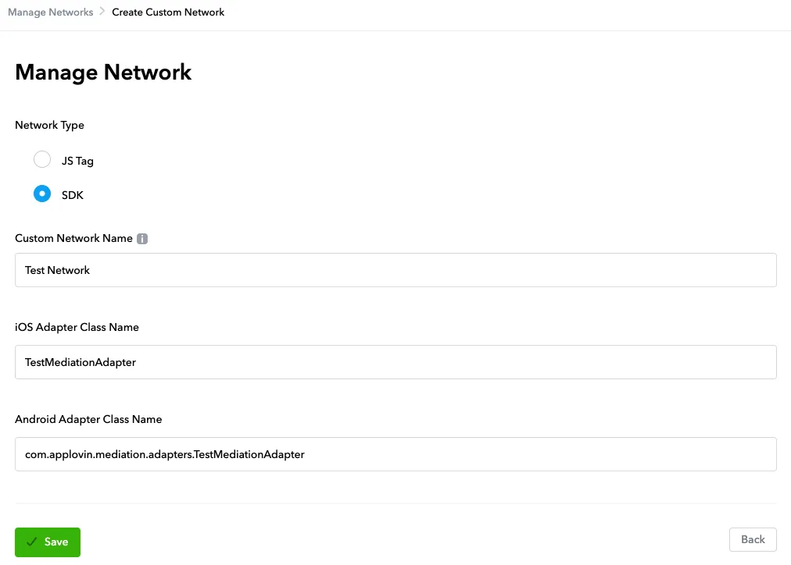
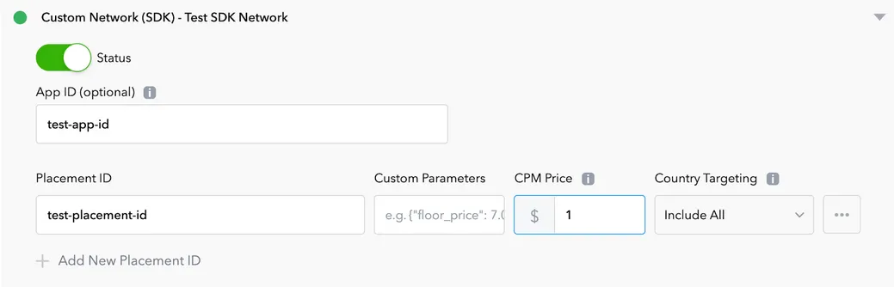

# Flat-Max-Adapter

## Release Notes

| Version       | Release Date       | Changes    |
|----------|------------|---------|
| 1.4.18.2 | 2024-02-23 | 	Initial release |
| 1.5.0.3  | 2024-04-19 | 	Updated with new style |
| 1.5.2.0  | 2024-12-04 | 	Updated with new style |

## Integrating the Adapter

First, add the Maven remote repository URLs to your project-level build.gradle file as follows:
```groovy
buildscript {
    repositories {
        maven { url "https://maven-pub.flat-ads.com/repository/maven-public/"}
        maven { url "https://jitpack.io" }
    }
}
allprojects {
    repositories {
        maven { url "https://maven-pub.flat-ads.com/repository/maven-public/"}
        maven { url "https://jitpack.io" }
    }
}

```
Next, include the Max Adapter package in your module's build.gradle file. Choose the dependency according to your project requirements:
```groovy
// Required dependency
implementation 'com.flatads.adapter:max:1.5.2.0'

// Additional dependency based on channel
// For GP:
implementation 'com.flatads.sdk:flatads:1.5.2.0-Flat'


```
## Defining the Adapter in the MAX Interface
1. **Enable the Custom SDK Ad Network:**  

a. In the MAX dashboard, navigate to MAX > Mediation > Manage > Networks.  
b. Click the "Click here to add a custom network" button at the bottom of the page to open the custom network creation screen.
c. **Enter your custom network information:**  
* Network Type ：Select SDK. 
* Name ：Enter the name of your custom network (e.g., FlatSDK Network).
* iOS Adapter Class Name ：Not supported.
* Android Adapter Class Name ：**com.flatads.adapter.max.FlatAdsMediationAdapter**(this value cannot be modified).
2. **Create an Ad Unit for the Custom Network:**  
a. **In the MAX dashboard, go to MAX > Mediation > Manage > Ad Units.**  
b. **Select the ad unit where you want to add the custom SDK network created in the previous step.**  
c. **Configure the following ad parameters (for specific values, please contact your business representative):**

   * 在 *AppID(optional)* enter the FlatAds platform app_id.
   * 在 *Placement ID* enter the FlatAds platform ad placement ID, for example: `6af5ffa0-bb5e-11ed-af5d-07a5f3732048`
   * 在 *Custom Parameters* In Custom Parameters, enter the FlatAds platform app_token in JSON format, for example:`{ "app_token":"YUOR_APP_TOKEN" }`
6. After completing the configuration, click Save. Please note that the changes may take approximately 30 to 60 minutes to take effect.

#### Notes：
1. For Banner ads, add the BannerView to the layout only after receiving the onAdLoaded callback. Otherwise, MAX may trigger a double load for the Banner, resulting in an invalid ad request.


